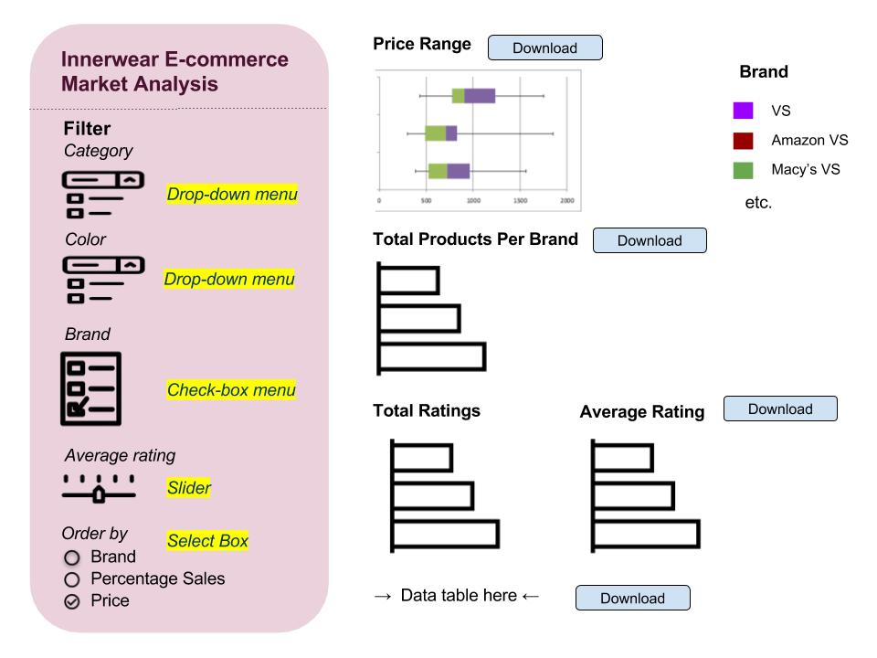

### Section 1: Overview

> In the past couple years, many retailers struggled to compete with the most popular online shopping site - Amazon. One of the retailers, Macy's, Inc closed around 200 stores during 2016 - 2017 period, and put more effort in building its online presence. Macy's revenue is [domitnated](https://www.statista.com/statistics/255585/macys-sales-share-worldwide-by-merchandise-department/) by female apparel, while Amazon surpassed this once-popular department store to become the biggest apparel seller in the US in [2017](http://www.businessinsider.com/amazon-is-taking-over-the-clothing-industry-2017-7). 
> 
> One of the main products in Macy's female apparel is innerwear. In order to help traditional retailers like Macy's to come up with a good pricing strategy for its innerwear online presence, I propose a a data visualization app that allows business analysts at those companies to understand the overall innerwear e-commerce market. This app lets users filter and select product category and colors, as well as consumer ratings to find out difference in price range, and number of options of several popular brands sold at brands' official websites, [Amazon.com](https://www.amazon.com) and [Macys.com](https://www.macys.com). 

### Section 2: Description of the data

> I will visualize a dataset of approximately 600,000 innerwear product data extracted from popular retail sites. In the raw dataset, each product has 14 attributes. For this project, I will use 9 attributes that show:
> * product name (product_name)
> * product source (brand, retailer)
> * product options (category, color)
> * consumer preference (rating, review_count)
> * price range (mrp - maximum retail price, price)
> * Using this data, I also derive a new variable, which is the percentage of sales for each product (sales_pct)
> 
> My data comes from [Kaggle](https://www.kaggle.com/PromptCloudHQ/innerwear-data-from-victorias-secret-and-others/data). It is approved by Vaden Masrani. 

### Section 3: Usage scenario & tasks

> Camila is a business analyst at Macy's, Inc and she wants to understand the overall e-commerce market for innerwear in order to design a business strategy for Macy's e-commerce innerwear section.
> 
> She wants to be able to [explore] the dataset in order to [compare] the effect of different variables that may have impact on price difference on multiple e-commerce websites, including Macys.com. From her comparison, she wants to [determine] the most relevant variables to frame her innerwear business strategy for Macy's. After using the app, Camila wants to [download] the filtered dataset and visualizations for her report summary.
>
> When Camila logs on to the "Innerwear E-commerce Market", she will see an overview of all attributes of the dataset, in form of visualizations and data table. Those visualizations include price difference and number of options among brands and retailers. She can filter out variables for comparisons, and/or rank brands/retailers according to their price, total number of products, or percentage of sales. When she does so, Camila may notice that Calvin Klein's panties has twice as many available options on Amazon.com as on Macys.com, and consumers rate this category, especially panties with red color very high among all all categories by Calvin Klein. She hypothesizes that consumers like Calvin Klein's panties, espcially red color ones. Camila decides to conduct a follow-up analysis in which she can understand what sizes of red panties are more popular to help Macy's stock up in their warehouse, since there is not enough data on size and there is no volumn sales data in the current dataset.

Note that in the above example, "physical disability" being an important variable is fictional - you don't need to conduct an analysis of your data to figure out what is important or not, you just need to imagine what someone could find, and how they may use this information.

## Section 4: Description of your app & sketch 

> The app contains a landing page that shows price range, total product per brand, total rating, average rating, and percentage of sales (horizontal box plot, horizontal bar chart) of each product category, colored coded according to brand. The landing page also include the filtered data table, as well as download button for each visualization and data table.
> 
> From the filter section, users can filter out variables by product category, product color, brand, and average rating. Finally, they can order visualizations by brand, percentage of sales or most expensive product price. 
